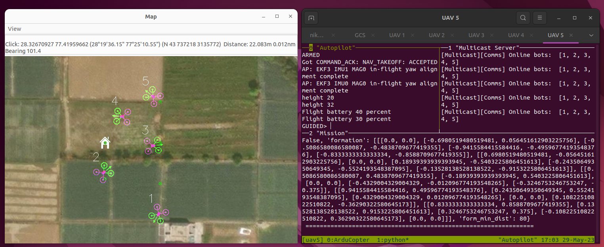

# Formation Healing
## ME41125: Introduction to Engineering Research

Name: Nikhil Sethi

Student number: 5711428

## Project goal
This repository contains code for reproducing the results of the paper titled *A self-healing algorithm for adaptive formation control with drone swarms* . The software is capable of producing a simulation of multiple drones which can heal themselves when some drones are lost as part of the formation.

## Requirements
The code has been tested with the following platforms. There may be additional setup required for your own platform.
- Ubuntu 22.04
- Python 3.8.16 

## Install

A handy installation script is provided which should ideally install everything for you. There are some links below which can be useful to debug any problems. Feel free to open an issue if you face problems.

```bash
# clone this repository
git clone git@github.com:nikhil-sethi/IER_2023.git
cd IER_2023

# setup the requirements
chmod +x tools/install.sh
./tools/install.sh

```

[Ardupilot software setup](https://ardupilot.org/dev/docs/building-setup-linux.html)

## Test
The above process should build the Ardupilot software successfully and you can run the following command to test a basic simulation:
```bash
sim_vehicle.py -v ArduCopter --map -- console
```
You should see some compilation, and eventually a map with a drone in it.

## Run

Close any testing sessions if you have open and run the following commands in a new terminal inside this projects repository.
By default a mission with 5 uavs and a predefined formation will run. 
```bash
python3 manager.py --gcs --server --simulation
```
If everything went well, there should be 6 terminals: 1 for each uav and 1 for the Ground control station (GCS).
To start the mission, in the same terminal:
```bash
python3 manager.py --mission --simulation
```
There should be logging going in each uav's terminal and the drones should start coming in formation like the following image:



### Self healing
Simulating a healing scenario is easy. In any of the UAV's "Autopilot" terminals, type the following command to remove the UAV from the swarm and land it safely.

```
mode land
```

### Formations
By default the code uses an "M" formation. If you want to change it, run the GUI, plan the formation and exit the window:
```bash
python3 plan_formation.py
``` 


Now save the mission file using the following command and run the mission like before:
```bash
python3 mission.py --write
```

## Licensing
This project is licensed under the [GNU GPLv3 License](https://gist.github.com/kn9ts/cbe95340d29fc1aaeaa5dd5c059d2e60) - see the [LICENSE.txt](LICENSE.txt) file for details

## Authors

  - **Nikhil Sethi** 
    [Github](https://github.com/nikhil-sethi)


## Acknowledgements
This work would not be possible without Ardupilot's comprehensive framework for testing drones in simulation.